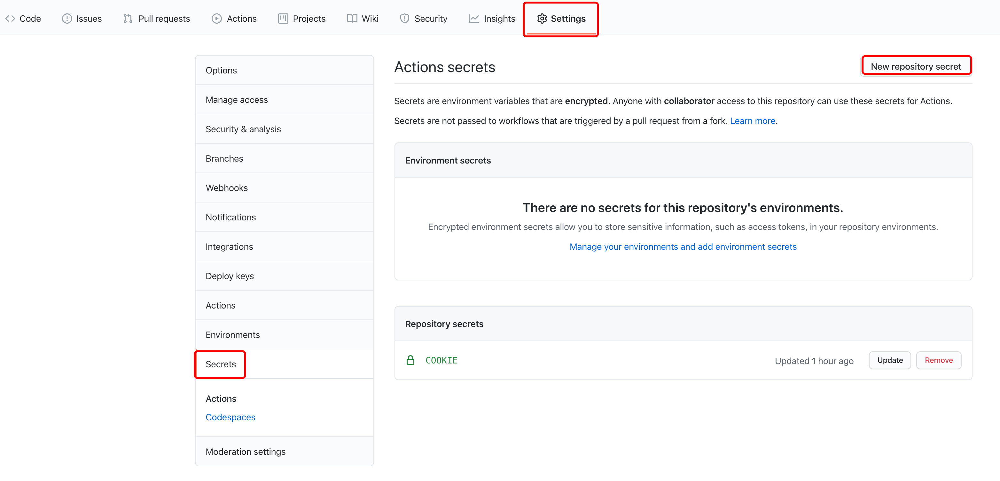

# auto-checkin

Please give a star :)


after many time, it will return `Checkin! Get 0 day(Your lucky chance is 33%), try next time.`，means 1/3 odds 1 day


## Step

### 1 get cookie

在 [GLaDOS](https://glados.rocks/console/checkin) 的网页上按 F12，进行请求，查看请求的 cookie。

### 2 set cookie

fork this to your repository**your**repository `Settings` - `Secrets` - `New repository secret`：



然后添加一个名为 `COOKIE` 的变量，内容为获取到的 cookie。

`COOKIE` 示例：

```text
__cfduid=d526a2a21******c5521611332007; _ga=GA1.2.101***3158.1611332010; _gid=GA1.2.11***23.1611332010; koa:sess=eyJ1c2VyS******fZXhwaXJlIjoxNjM3MjU0NjEzMTEyLCJfbWF4QWd****yMDAwMDAwMH0=; koa:sess.sig=m6KAoBnv1s***DldbtvNw1v8; _gat_gtag_UA_10***600_2=1
```

### 3 运行 

随便发起一个 push 请求，可以修改一下 `README.md`，或者自己给自己点个 star，就可以开始。之后就会每隔 6 小时进行一次签到（因为有时候签到会失败，好像是服务器不太好，就设置一下每小时签到一次保证成功吧）。

注意，在官方文档中有这么一段：

> To prevent unnecessary workflow runs, scheduled workflows may be disabled automatically. When a public repository is forked, scheduled workflows are disabled by default. In a public repository, scheduled workflows are automatically disabled when no repository activity has occurred in 60 days.

也就是说，**定时执行的任务需要每隔 60 天激活一次**。

+2
